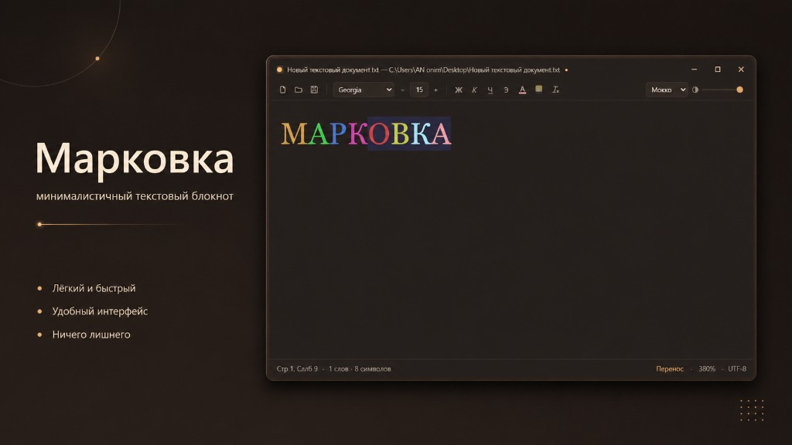

# Blocnot



Минималистичная замена Блокноту Windows: тёмный, полупрозрачный, с темами и форматированием.

## Возможности

- 6 тем: Графит, Чёрный (OLED), Полночь, Мокко, Лес, Светлая
- Регулировка прозрачности окна (ползунок в панели)
- Масштабирование: `Ctrl + колесо`, `Ctrl +/-`, `Ctrl 0` — сброс
- Выбор шрифта и размера
- Форматирование для заметок: жирный/курсив/подчёркнутый/зачёркнутый, цвет текста, маркер
  (в `.txt` сохраняется только чистый текст — формат живёт в рамках сессии)
- Перенос строк (вкл/выкл в статус-баре), счётчик слов/символов, позиция курсора
- Несколько окон (`Ctrl+Shift+N`), запрос на сохранение при закрытии

## Горячие клавиши

| Клавиши | Действие |
|---|---|
| `Ctrl+N` | Новый файл |
| `Ctrl+O` | Открыть |
| `Ctrl+S` | Сохранить |
| `Ctrl+Shift+S` | Сохранить как |
| `Ctrl+Shift+N` | Новое окно |
| `Ctrl+B / I / U` | Жирный / курсив / подчёркнутый |
| `Ctrl + колесо / +/- / 0` | Масштаб |

## Разработка

```bash
npm install        # зависимости
npm start          # запуск в dev-режиме
npm run dist       # установщик NSIS → dist/Blocnot-Setup-1.0.0.exe
npm run dist:portable  # portable-версия без установки
```

## Установка

1. Собери установщик: `npm run dist`
2. Запусти `dist\Blocnot-Setup-1.0.0.exe`

Мастер установки:
- выбор папки установки
- ярлык на рабочем столе и в меню Пуск
- регистрация для `.txt`, `.log`, `.ini`, `.cfg`, `.md`
- деинсталлятор в «Приложения и компоненты» Windows
- опция «Запустить Blocnot» после установки

Или через скрипт (запускает готовый Setup):

```powershell
powershell -ExecutionPolicy Bypass -File install.ps1
```

Чтобы `.txt` открывались в Blocnot по двойному клику: ПКМ по любому `.txt` →
**Открыть с помощью** → **Blocnot** → галочка **«Всегда использовать это приложение»**.
Один раз — Windows не даёт программам менять приложение по умолчанию автоматически.

> `scripts/dns-proxy.js` — вспомогательный локальный прокси (DNS-over-HTTPS) на
> случай, если системный DNS не работает и npm не может качать пакеты:
> `node scripts/dns-proxy.js`, затем `npm install --proxy http://127.0.0.1:8231 --https-proxy http://127.0.0.1:8231`.
